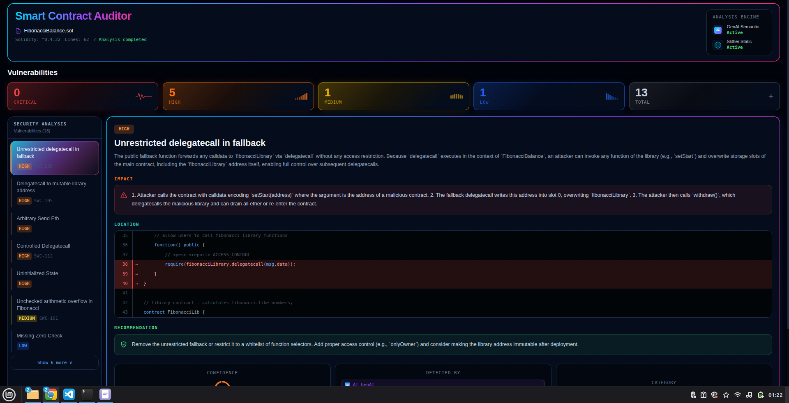

# Smart Contract Auditor —> Project Overview

A web app that lets you upload a Solidity smart contract and get back a detailed security report.
It combines two analysis engines: an LLM (via Groq) for semantic understanding, and Slither for
precise static analysis. The two results are merged and deduplicated before being sent to the UI.




## How it works —> the big picture

```
User uploads .sol file
        │
        ▼
  [Next.js Frontend]
  Sends file to backend via POST /api/v1/audit
        │
        ▼
  [FastAPI Backend]
  Runs the audit pipeline:
    1. Validate  →  basic sanity checks on the file
    2. LLM node  →  sends code to Groq (llama-3.3-70b), gets back vulnerabilities in JSON
    3. Slither   →  runs static analysis locally, gets back precise line numbers
    4. Merge     →  deduplicates findings from both engines, builds the final report
        │
        ▼
  Returns JSON report
        │
        ▼
  [Next.js Frontend]
  Renders the report: stats bar, sidebar list, vulnerability detail panel
```

## Backend

The backend is a **Python + FastAPI** app deployed on Render via Docker.

### Entry point —> `main.py`

Boots the FastAPI app, sets up logging, and registers the API routes.
It also configures CORS so the frontend (on a different domain) is allowed to call the API.

### API —> `routes.py`

Two endpoints:

| Endpoint | What it does |
|---|---|
| `POST /api/v1/audit` | Accepts a `.sol` file upload, runs the pipeline, returns the JSON report |
| `GET /api/v1/health` | Simple liveness check used by Render to know the server is up |

Before handing the file to the pipeline, the route validates it:
- Must be a `.sol` file
- Must not be empty
- Must be under 500 KB
- Must be valid UTF-8 text

### Pipeline —> `graph.py`

The audit logic is built as a **LangGraph** graph. a directed flow of nodes where each step
reads from a shared state dict, does its work, and writes its results back.

```
START → validate → llm_analysis → slither_analysis → merge_reports → END
                ↘ abort → END   (if the file is completely empty)
```

The shared state (`state.py`) acts like a whiteboard that every node can read and write.
It holds the contract code, intermediate results from each node, and a list of non-fatal errors.

### Node 1 —> `llm_node.py`

Sends the contract to the **Groq API** (free LLM hosting) and asks it to find vulnerabilities.

- Model used: `llama-3.3-70b-versatile`
- The LLM receives a detailed system prompt from `data/instructions/prompt.txt`
- It returns a structured JSON with vulnerability descriptions, exploitation scenarios,
  recommendations, and approximate line numbers
- Because LLMs sometimes wrap JSON in markdown fences, the node strips those before parsing

**What the LLM is good at:** understanding *what* the code does and *why* something is dangerous.
Rich prose descriptions, exploitation scenarios, and fix recommendations.

**What the LLM is bad at:** pinpointing the exact line number where a bug lives.

### Node 2 —> `slither_node.py`

Runs **Slither**, an open-source static analyser for Solidity, as a local subprocess.

Before running it, the node:
1. Reads the `pragma solidity` version from the contract source
2. Installs that exact compiler version via `solc-select` if it's not already present
3. Switches to it so Slither compiles the contract correctly

Slither produces a JSON file listing every issue it detected, including the exact line numbers
from the compiler. The node normalises these into the same schema the LLM node uses.

**What Slither is good at:** compiler-verified line numbers, fast pattern detection, no hallucination.

**What Slither is bad at:** it has no understanding of *why* something is dangerous, just that
a known pattern was matched.

### Node 3 —> `merge_node.py`

Combines the findings from both engines into one clean, deduplicated list.

Deduplication works in two steps:
1. **Exact SWC ID match** —> if both engines flagged the same weakness class (e.g. SWC-107 Reentrancy), they're merged into one finding tagged `source: "BOTH"`
2. **Category keyword overlap** —> if there's no SWC ID, it checks if the category names share more than 40% of their words

When two findings are merged, the result gets the **LLM's prose** (richer descriptions)
and **Slither's line numbers** (more accurate). If they disagreed on severity, the higher rating wins.

The final list is sorted by severity (CRITICAL first) and wrapped in the report object
that gets sent back to the frontend.


## Frontend

The frontend is a **Next.js + TypeScript** app styled with **Tailwind CSS**.
It has two screens: the upload form and the report view.

### Tooling / config files

| File | Purpose |
|---|---|
| `package.json` | Project dependencies and npm scripts (`dev`, `build`, `start`) |
| `next.config.js` | Next.js settings (currently empty — defaults are fine) |
| `tailwind.config.ts` | Custom colour palette, font families, and which files Tailwind scans |
| `postcss.config.js` | Tells PostCSS to run Tailwind and Autoprefixer on every CSS file |
| `tsconfig.json` | TypeScript compiler settings, including the `@/*` path alias |
| `globals.css` | Global styles: fonts, dark background, custom scrollbar, reusable CSS classes |
| `layout.tsx` | Root shell that wraps every page (sets the HTML `<title>` and loads global CSS) |

### Types —> `report.ts`

Defines the TypeScript shape of every object the backend returns.
If the backend changes its response format, TypeScript will immediately flag the mismatch.

Key types:
- `AuditReport` — the root object returned by the API
- `Vulnerability` — a single finding with severity, description, line numbers, source, etc.
- `Severity` — `CRITICAL | HIGH | MEDIUM | LOW | INFO`
- `Source` — `LLM | SLITHER | BOTH`

### Screen 1 —> `page.tsx` (upload form)

Manages the overall app state with four possible values: `idle → scanning → done | error`.

**idle:** Shows the file upload box and the "Detect Vulnerabilities" button (disabled until a file is selected).

**scanning:** Hides the form and shows an animated radar icon with a rotating status message
(e.g. "Detecting reentrancy patterns…"). Messages cycle every ~2 seconds via `setInterval`.

**done:** Unmounts the upload screen entirely and renders `<ReportView>` instead.

**error:** Shows the error message returned by the backend and a "Try again" button.

When the user picks a file, the page reads its text content immediately so it can later pass it
to the report view for accurate line highlighting.

### Upload component —> `FileUpload.tsx`

A drag-and-drop file picker that only accepts `.sol` files.
- Shows the filename and file size once a file is selected, with a "Remove" button to clear it

### Screen 2 —> `ReportView.tsx` (audit results)

The main results dashboard. Laid out in three sections:

**Header card** —> shows the contract filename, Solidity version, line count, and which
analysis engines were active (GenAI always on; Slither shows green only if it ran successfully).

**Stats bar** —> five cards showing the count of findings per severity level (CRITICAL, HIGH, MEDIUM, LOW, Total).

**Two-column panel:**
- *Left sidebar* —> scrollable list of vulnerability titles. Clicking one selects it.
  Initially shows the first 7 findings; a "Show N more" button reveals the rest.
- *Right panel* —> full detail of the selected vulnerability:
  - Severity badge + title + description
  - Impact (exploitation scenario)
  - Location (code viewer with highlighted lines)
  - Recommendation (how to fix it)
  - Bottom row: confidence ring, "Detected By" badges (LLM / Slither / Both), category + SWC ID

#### Code viewer (`CodeBlock`)

Shows the vulnerable lines with 3 lines of surrounding context and highlights them in red.

Finding the right lines is a three-step fallback:
1. **Search the file** for the LLM's `affected_code_snippet` text —<> fixes cases where the LLM
   returned a wrong line number (e.g. line 1 as a fallback)
2. **Use backend line numbers** if the search finds nothing
3. **Show the raw snippet** as-is if no file content was passed in

The code is colourised by a lightweight inline tokeniser (no external library) that handles
Solidity keywords, strings, numbers, and comments.


The only secret the backend needs is `GROQ_API_KEY`, set manually in the Render dashboard. (already set)
The only thing the frontend needs is `NEXT_PUBLIC_API_URL` pointing to the Render backend URL. (already set)